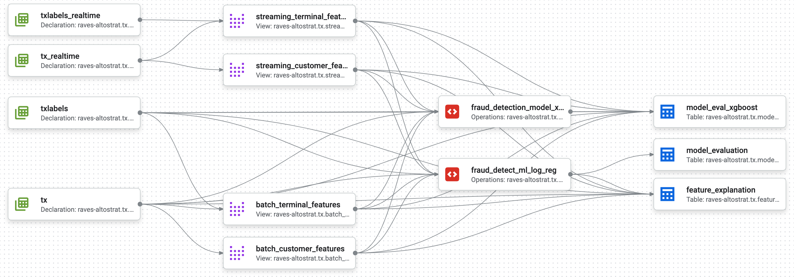

# Data-to-AI-TechLab
## GCP Data to AI Tech Lab Challenge (fraudfinder)


## Step 0: Select your Google Cloud project
Please make sure that you have selected a Google Cloud project as shown below: image

## Step 1: Initial setup using Cloud Shell
Activate Cloud Shell in your project by clicking the Activate Cloud Shell button as shown in the image below. 


Once the Cloud Shell has activated, copy the following codes and execute them in the Cloud Shell to enable the necessary APIs, and create Pub/Sub subscriptions to read streaming transactions from public Pub/Sub topics.

Authorize the Cloud Shell if it prompts you to. Please note that this step may take a few minutes. You can navigate to the Pub/Sub console to verify the subscriptions.

```shell
gcloud services enable notebooks.googleapis.com
gcloud services enable cloudresourcemanager.googleapis.com
gcloud services enable aiplatform.googleapis.com
gcloud services enable pubsub.googleapis.com
gcloud services enable run.googleapis.com
gcloud services enable cloudbuild.googleapis.com
gcloud services enable dataflow.googleapis.com
gcloud services enable bigquery.googleapis.com
gcloud services enable artifactregistry.googleapis.com
gcloud services enable iam.googleapis.com

gcloud pubsub subscriptions create "ff-tx-sub" --topic="ff-tx" --topic-project="cymbal-fraudfinder"
gcloud pubsub subscriptions create "ff-txlabels-sub" --topic="ff-txlabels" --topic-project="cymbal-fraudfinder"

# Run the following command to grant the Compute Engine default service account access to read and write pipeline artifacts in Google Cloud Storage.
PROJECT_ID=$(gcloud config get-value project)
PROJECT_NUM=$(gcloud projects list --filter="$PROJECT_ID" --format="value(PROJECT_NUMBER)")
gcloud projects add-iam-policy-binding $PROJECT_ID \
      --member="serviceAccount:${PROJECT_NUM}-compute@developer.gserviceaccount.com"\
      --role='roles/storage.admin'
gcloud projects add-iam-policy-binding $PROJECT_ID \
      --member="serviceAccount:${PROJECT_NUM}@cloudbuild.gserviceaccount.com"\
      --role='roles/aiplatform.admin'
gcloud projects add-iam-policy-binding $PROJECT_ID \
      --member="serviceAccount:$PROJECT_NUM-compute@developer.gserviceaccount.com"\
      --role='roles/run.admin'
gcloud projects add-iam-policy-binding $PROJECT_ID \
      --member="serviceAccount:$PROJECT_NUM-compute@developer.gserviceaccount.com"\
      --role='roles/resourcemanager.projectIamAdmin'
gcloud projects add-iam-policy-binding $PROJECT_ID \
      --member="serviceAccount:service-${PROJECT_NUM}@gcp-sa-aiplatform.iam.gserviceaccount.com"\
      --role='roles/artifactregistry.writer'
gcloud projects add-iam-policy-binding $PROJECT_ID \
      --member="serviceAccount:service-${PROJECT_NUM}@gcp-sa-aiplatform.iam.gserviceaccount.com"\
      --role='roles/storage.objectAdmin'   
```

## Step 2: Copy the historical transaction data into BigQuery tables
```shell
$ python3 scripts/copy_bigquery_data.py $BUCKET_NAME
```
## Step 3: Create BigQuery tables for realtime streaming data and Pub/Sub to BQ subscription
```sql
create table `{PROJECT_ID}.{Dataset_ID}.txlabels_realtime` as SELECT * FROM `{PROJECT_ID}.{Dataset_ID}.txlabels.txlabels` where 1=0;

create table `{PROJECT_ID}.{Dataset_ID}.tx_realtime` as SELECT * FROM `{PROJECT_ID}.{Dataset_ID}.tx` where 1=0;
```
## (C1) Step 4: EDA of transaction data in BigQuery

- Transaction data summary statistics
- Fraud Classification counts and percentages
- Plot transaction amount distribution
- Analyse customer-level aggregates of transaction data
- Customer and Terminal Analysis

## (C2) Step 5: Feature Engineering

### Objective
The goal of this step is to create features, based on historical customer behaviour and historical terminal activities. These features will be batch-generated using SQL in BigQuery, where the historical data is stored.

### Data Context

The source dataset contains transaction information including transaction ID, timestamps, customer ID, terminal ID, transaction amounts and fraud labels. The relevant tables for this section are:
* ``` tx.tx```
* ``` tx.txlabels ```

### Task

Write SQL queries to compute 2 sets of features:

**Query 1: Customer-related features:** describes the spending behaviour of customer within (a) 15, 30 and 60 mins time windows and (b) 1, 7 and 14 days time windows using ***number of transactions*** and ***average amount spent in dollars ($)***.

* Complete the SQL query to create the customer features view under ``` C2-FE ```

Below is the expected output view for this query:

| feature_time             | customer_id | customer features |
| :------------------------- | :---------- | :----------------------- |
| 2025-02-01 17:20:15 UTC   | 1           | (e.g., nb_tx, avg_tx)   |
| 2025-02-02 12:08:40 UTC   | 2           | (e.g., nb_tx, avg_tx)   |
| 2025-02-03 17:30:48 UTC   | 3           | (e.g., nb_tx, avg_tx)   |

**Query 2: Terminal risk features:** describes the risk of a given terminal to be exposed to fraudulent transactions within the last (a) 15, 30 and 60 mins and (b) 1, 7 and 14 days using ***average number of fraudulent transactions in dollars ($)***, the ***number of transactions*** and ***risk index***. Please note that a delay will need to be added to take into account time that would pass between the time of transaction and the result of fraud investigation or customer claim.

* Complete the SQL query to create the terminal risk features view under ``` C2-FE ```

Below is the expected output view for this query:

| feature_time             | terminal_id | terminal risk features |
| :------------------------- | :---------- | :----------------------- |
| 2025-02-01 17:20:15 UTC   | 12345       | (e.g., risk_x_days)     |
| 2025-02-02 12:08:40 UTC   | 26789       | (e.g., risk_x_days)     |
| 2025-02-03 17:30:48 UTC   | 101112      | (e.g., risk_x_days)     |

**Verify your results by running** 
```sql 
SELECT * FROM <TABLE> LIMIT 10
```

## (C3) Step 6: Model Development (BigQuery ML)

Focus on simple but effective model:
- Use Random Forest Classifier
- Implement cross-validation
- Calculate key metrics (AUC-ROC, Precision, Recall)



## (C4) Step 7: Model Inference
### Create BigQuery Table for online predictions
```sql
CREATE TABLE IF NOT EXISTS `{PROJECT_ID}.{Dataset_ID}.online_fraud_prediction`
(
  TX_ID STRING,
  prediction_timestamp TIMESTAMP,
  fraud_probability FLOAT64,
  is_fraud BOOLEAN,
  model_version STRING,
  created_at TIMESTAMP DEFAULT CURRENT_TIMESTAMP
);
```
### Deploy the model for online predictions

- Get the VertexAI Endpoint ID
- Copy the "./C4-Real-Time Inference/fraud_online_inference.py" for online predictions to BigQuery Notebook and fill-in the required configurations.