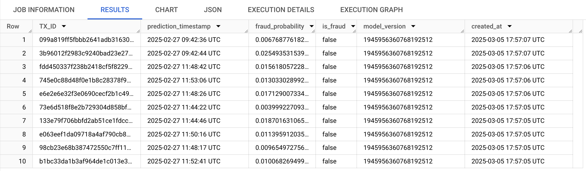

# Data-to-AI-TechLab
## GCP Data to AI Tech Lab Challenge (fraudfinder)


## Step 0: Initalisation and Setup
### Select your Google Cloud project
Please make sure that you have selected a Google Cloud project as shown below: image

### Initial setup using Cloud Shell
Activate Cloud Shell in your project by clicking the Activate Cloud Shell button as shown in the image below. 


Once the Cloud Shell has activated, copy the following codes and execute them in the Cloud Shell to enable the necessary APIs, and create Pub/Sub subscriptions to read streaming transactions from public Pub/Sub topics.

Authorize the Cloud Shell if it prompts you to. Please note that this step may take a few minutes. You can navigate to the Pub/Sub console to verify the subscriptions.

```shell
cd Data-to-AI-TechLab
gcloud services enable notebooks.googleapis.com
gcloud services enable cloudresourcemanager.googleapis.com
gcloud services enable aiplatform.googleapis.com
gcloud services enable pubsub.googleapis.com
gcloud services enable run.googleapis.com
gcloud services enable cloudbuild.googleapis.com
gcloud services enable dataflow.googleapis.com
gcloud services enable bigquery.googleapis.com
gcloud services enable artifactregistry.googleapis.com
gcloud services enable iam.googleapis.com

gcloud pubsub subscriptions create "ff-tx-sub" --topic="ff-tx" --topic-project="cymbal-fraudfinder"
gcloud pubsub subscriptions create "ff-txlabels-sub" --topic="ff-txlabels" --topic-project="cymbal-fraudfinder"
```
### Check completion of service enables
```shell
gcloud services list --enabled --filter="NAME:(notebooks.googleapis.com OR cloudresourcemanager.googleapis.com OR aiplatform.googleapis.com OR pubsub.googleapis.com OR run.googleapis.com OR cloudbuild.googleapis.com OR dataflow.googleapis.com OR bigquery.googleapis.com OR artifactregistry.googleapis.com OR iam.googleapis.com)"
```
### Grant required IAM permissions
```shell
# Run the following command to grant the Compute Engine default service account access to read and write pipeline artifacts in Google Cloud Storage.
PROJECT_ID=$(gcloud config get-value project)
PROJECT_NUM=$(gcloud projects list --filter="$PROJECT_ID" --format="value(PROJECT_NUMBER)")
gcloud projects add-iam-policy-binding $PROJECT_ID \
      --member="serviceAccount:${PROJECT_NUM}-compute@developer.gserviceaccount.com"\
      --role='roles/storage.admin'
gcloud projects add-iam-policy-binding $PROJECT_ID \
      --member="serviceAccount:${PROJECT_NUM}@cloudbuild.gserviceaccount.com"\
      --role='roles/aiplatform.admin'
gcloud projects add-iam-policy-binding $PROJECT_ID \
      --member="serviceAccount:$PROJECT_NUM-compute@developer.gserviceaccount.com"\
      --role='roles/run.admin'
gcloud projects add-iam-policy-binding $PROJECT_ID \
      --member="serviceAccount:$PROJECT_NUM-compute@developer.gserviceaccount.com"\
      --role='roles/resourcemanager.projectIamAdmin'
gcloud projects add-iam-policy-binding $PROJECT_ID \
      --member="serviceAccount:service-${PROJECT_NUM}@gcp-sa-pubsub.iam.gserviceaccount.com"\
      --role='roles/bigquery.dataEditor'
gcloud projects add-iam-policy-binding $PROJECT_ID \
      --member="serviceAccount:service-${PROJECT_NUM}@gcp-sa-aiplatform.iam.gserviceaccount.com"\
      --role='roles/artifactregistry.writer'
gcloud projects add-iam-policy-binding $PROJECT_ID \
      --member="serviceAccount:service-${PROJECT_NUM}@gcp-sa-aiplatform.iam.gserviceaccount.com"\
      --role='roles/storage.objectAdmin'   
```
### Clone git repo
```shell
git clone https://github.com/gargravish/Data-to-AI-TechLab.git
```
### Navigate to the directory and install required libraries
```shell
cd Data-to-AI-TechLab
pip3 install -r requirements.txt
```
### Copy the historical transaction data into BigQuery tables
```shell
REGION="us-central1"
BUCKET_NAME="${PROJECT_ID}-fraudfinder" 
gsutil mb -l $REGION gs://$BUCKET_NAME
python3 scripts/copy_bigquery_data.py $BUCKET_NAME
```

## Step 1: EDA of transaction data in BigQuery (C1)

- ### Basic Transaction Analysis
This section focuses on understanding the overall structure and distribution of the transaction data.
 - Key Objectives:
   - Calculate basic statistics such as the number of transactions, date range, number of customers, and transaction amounts.
   - Analyze the distribution of fraudulent vs. non-fraudulent transactions.
 - Example Queries:
   - Aggregate functions like COUNT, MIN, MAX, and AVG to summarize data.
   - Use GROUP BY and SAFE_DIVIDE to calculate percentages of fraud.

- ### Amount Distribution Analysis
This section explores the distribution of transaction amounts and their relationship to fraud.
 - Key Objectives:
   - Identify common transaction values by rounding amounts.
   - Compare transaction amount patterns for fraudulent and non-fraudulent transactions.
 - Example Queries:
   - Use ROUND to group transactions by rounded amounts.
   - Join tx.tx with tx.txlabels to analyze fraud patterns.

- ### Customer Analysis
This section examines customer behavior to identify high-risk customers.
 - Key Objectives:
   - Calculate customer-level metrics such as the number of transactions, average transaction amount, and fraud rate.
   - Identify customers with unusual transaction patterns or high fraud rates.
 - Example Queries:
   - Use GROUP BY CUSTOMER_ID to calculate metrics.
   - Apply HAVING to filter high-risk customers based on fraud rates.

- ### Terminal Analysis
This section investigates terminal-level metrics to detect suspicious activity.
 - Key Objectives:
   - Calculate metrics such as the number of transactions, average transaction amount, and fraud rate for each terminal.
   - Identify terminals with high fraud rates.
 - Example Queries:
   - Use GROUP BY TERMINAL_ID to calculate metrics.
   - Apply SAFE_DIVIDE to compute fraud rates.

- ### Bonus Challenge
For participants who complete the main sections, the following challenges provide additional insights:
 - Time-Based Patterns:
   - Analyze transaction patterns by hour or day.
   - Extract time components from TX_TS and group transactions accordingly.
 - Suspicious Amount Patterns:
   - Identify frequently repeated transaction amounts.
   - Look for patterns in fraud rates for these amounts.

## Step 2: Feature Engineering (C2)

### Objective
The goal of this step is to create features, based on historical customer behaviour and historical terminal activities. These features will be batch-generated using SQL in BigQuery, where the historical data is stored.

### Data Context

The source dataset contains transaction information including transaction ID, timestamps, customer ID, terminal ID, transaction amounts and fraud labels. The relevant tables for this section are:
* ``` tx.tx```
* ``` tx.txlabels ```

### Task

Write SQL queries to compute 2 sets of features:

**Query 1: Customer-related features:** describes the spending behaviour of customer within (a) 15, 30 and 60 mins time windows and (b) 1, 7 and 14 days time windows using ***number of transactions*** and ***average amount spent in dollars ($)***.

* Complete the SQL query to create the customer features view under ``` C2-FE ```

Below is the expected output view for this query:

| feature_time             | customer_id | customer features |
| :------------------------- | :---------- | :----------------------- |
| 2025-03-10 17:20:15 UTC   | 1           | (e.g., nb_tx, avg_tx)   |
| 2025-03-10 12:08:40 UTC   | 2           | (e.g., nb_tx, avg_tx)   |
| 2025-03-09 17:30:48 UTC   | 3           | (e.g., nb_tx, avg_tx)   |

**Query 2: Terminal risk features:** describes the risk of a given terminal to be exposed to fraudulent transactions within the last (a) 15, 30 and 60 mins and (b) 1, 7 and 14 days using ***average number of fraudulent transactions in dollars ($)***, the ***number of transactions*** and ***risk index***. Please note that a delay will need to be added to take into account time that would pass between the time of transaction and the result of fraud investigation or customer claim.

* Complete the SQL query to create the terminal risk features view under ``` C2-FE ```

Below is the expected output view for this query:

| feature_time             | terminal_id | terminal risk features |
| :------------------------- | :---------- | :----------------------- |
| 2025-03-10 17:20:15 UTC   | 12345       | (e.g., risk_x_days)     |
| 2025-03-10 12:08:40 UTC   | 26789       | (e.g., risk_x_days)     |
| 2025-03-09 17:30:48 UTC   | 101112      | (e.g., risk_x_days)     |

**Verify your results by running** 
```sql 
SELECT * FROM <VIEW> LIMIT 10
```

## Step 3: Model Development with BigQuery ML (C3)
### Objective
After feature engineering, you are now ready to train and deploy your machine learning model to predict whether a transaction is fraudulent or not. You will train with BigQuery ML, register the model to Vertex AI Model Registry before you deploy it to an endpoint for real-time prediction.

### Approach
Here's a quick breakdown the models supported in BigQuery ML, for the fraud detection use case, you will go through two different model approaches:
* Supervised learning - use Logistic Regression and Boosted Tree Classifer to predict fraud labels
* Unsupervised learning - use Kmeans as part of the anomaly detection function in BigQuery to spot outliers


### Task
In this step, you will write sql queries to perform the following tasks in [C3-ML](https://github.com/gargravish/Data-to-AI-TechLab/blob/main/C3-ML/BQML.sql):

* Join back both the customer-related and terminal risk features to the grouth truth table, narrow down the time period to the past 15 days and split the first 10 days for training and remaining 5 days for testing
* Use the supervised learning approach
  * train a logistic regression model in BigQuery and register the model in Vertex AI
  * evaluate model metrics and run test prediction
  * train a xgboost model in BigQuery and register the model in Vertex AI
  * evaluate model metrics and run test prediction
* Use the unsupervised learning approach
  * train a kmeans model in BigQuery
  * feed the model into the anomaly detection function in BigQuery for testing purposes

### Resource
[Logistic Regression Model](https://cloud.google.com/bigquery/docs/reference/standard-sql/bigqueryml-syntax-create-glm)

[Boosted Trees Model](https://cloud.google.com/bigquery/docs/reference/standard-sql/bigqueryml-syntax-create-boosted-tree)

[Kmeans Model](https://cloud.google.com/bigquery/docs/reference/standard-sql/bigqueryml-syntax-create-kmeans)

[ML.DETECT_ANOMALIES Function](https://cloud.google.com/bigquery/docs/reference/standard-sql/bigqueryml-syntax-detect-anomalies)


## Step 4 : Real Time Model Inference (C4)
### Create BigQuery Table for online predictions
```sql
CREATE TABLE IF NOT EXISTS `{PROJECT_ID}.{Dataset_ID}.online_fraud_prediction`
(
  TX_ID STRING,
  prediction_timestamp TIMESTAMP,
  fraud_probability FLOAT64,
  is_fraud BOOLEAN,
  model_version STRING,
  created_at TIMESTAMP DEFAULT CURRENT_TIMESTAMP
);
```
### Setup Pub/Sub to BQ Subscription for Realtime Streaming Data
- Pub/Sub Topic: `projects/cymbal-fraudfinder/topics/ff-tx`


### Deploy the model for online predictions

- Get the VertexAI Endpoint ID
- Copy the "./C4-Real-Time Inference/fraud_online_inference.py" for online predictions to BigQuery Notebook and fill-in the required configurations.

### Check BigQuery Table for generated inferences
```sql
SELECT * FROM `tx.online_fraud_prediction` order by created_at desc LIMIT 10
```


---
<p align="center">END</p>

---
